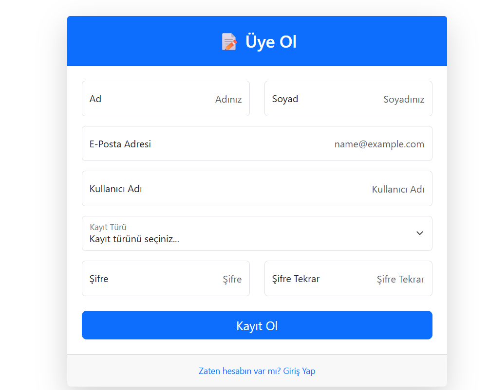
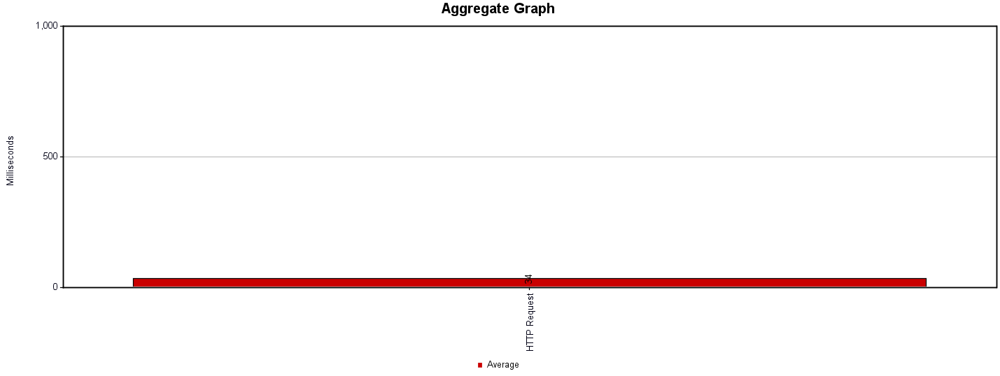
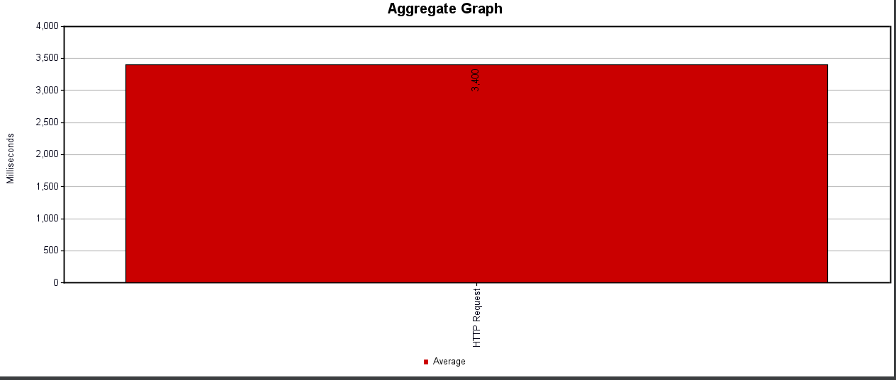
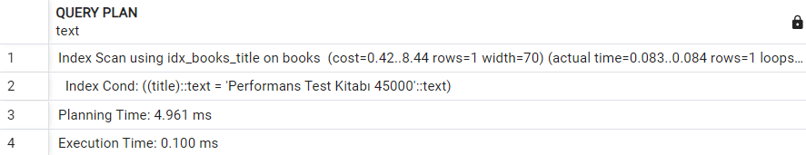

# 📚 Web GIS Library Management System


This project was developed as part of the final assignment for the **GMT 458 – Web GIS** course. It is a web-based **Library Information System** that manages both spatial and non-spatial data together, featuring different user roles.

The project is designed in accordance with modern architecture using **ASP.NET Core MVC**, **PostgreSQL (PostGIS)**, and **Entity Framework Core** technologies.

---

## 🚀 Project Features and Requirements (Rubric)

The table below summarizes the extent to which the project requirements have been met:

| Requirement | Status | Description |
| :--- | :---: | :--- |
| **Source Code Management** | ✅ Done | Project version control is provided via GitHub. |
| **Managing User Types** | ✅ Done | **3 Different Roles:** <br>🎓 **Student:** 15-day borrowing period.<br>👨‍🏫 **Academician:** 30-day borrowing period.<br>🛡️ **Admin:** Full authority/access. |
| **CRUD Operations (Spatial)** | ✅ Done | Library branches (Spatial Point) can be **Added, Deleted, Updated, and Listed** via the map. |
| **Authentication** | ✅ Done | Secure cookie-based **Sign-up** and **Login** mechanism. |
| **API Development** | ✅ Done | **RESTful API:** Spatial (Branch) and Non-spatial (Book) data are exposed. <br>📄 **Swagger:** Documentation is available at `/swagger`. |
| **Database** | ✅ Done | **PostgreSQL** is used for relational data, and **PostGIS** for geographic data. |
| **Dashboard** | ✅ Done | The admin panel includes real-time statistics and **Chart.js** graphs showing book categories. |
| **Performance Testing** | ✅ Done | Load and Stress tests were applied using **Apache JMeter**, and response times were analyzed. |
| **Performance Monitoring** | ✅ Done | The effect of **B-Tree** and **R-Tree** indexing on query performance was analyzed. |

---

## 🛠️ Tech Stack

* **Backend:** ASP.NET Core 7.0 (MVC & Web API)
* **Database:** PostgreSQL 14+ & PostGIS Extension
* **ORM:** Entity Framework Core (Spatial data support with NetTopologySuite)
* **Frontend:** HTML5,JavaScript
* **Visualization:** Chart.js (Statistics)
* **Test & Documentation:** Apache JMeter, Swagger UI

### System Demo Video

([Watch on YouTube](https://www.youtube.com/watch?v=knZImprxyPM))

## 📸 Screenshots

### 1. Login and Registration Panel
Login and registration panel for users.


### 1. Admin Panel (Dashboard)
Summary statistics and graphical reports for administrators.


### 2. Swagger API Documentation
Interface for testing RESTful services.


### 3. Map and Branch Management
PostGIS-supported branch addition and viewing screen.


---

## ⚙️ Installation

Follow the steps below to run the project on your local machine:

1.  **Clone the Project:**
    ```bash
    git clone [https://github.com/YOUR_USERNAME/LibrarySystem.git](https://github.com/YOUR_USERNAME/LibrarySystem.git)
    cd LibrarySystem
    ```

2.  **Configure Database Connection:**
    Open the `appsettings.json` file and edit the `ConnectionStrings` section with your own PostgreSQL credentials:
    ```json
    "ConnectionStrings": {
      "LibraryContext": "Host=localhost;Database=LibraryDb;Username=postgres;Password=yourpassword"
    }
    ```

3.  **Create the Database (Migration):**
    Open the terminal in the project directory and run the following command:
    ```bash
    dotnet ef database update
    ```

4.  **Start the Project:**
    ```bash
    dotnet run
    ```

---

## 🔗 API Usage

To test API endpoints while the project is running:
👉 **URL:** `https://localhost:7239/swagger`

| Method | Endpoint | Description |
| :--- | :--- | :--- |
| **GET** | `/api/LibraryApi/branches` | Retrieves all library branches (GeoJSON). |
| **POST** | `/api/LibraryApi/branches` | Adds a new branch. |
| **PUT** | `/api/LibraryApi/branches/{id}` | Updates branch details. |
| **DELETE** | `/api/LibraryApi/branches/{id}` | Deletes the branch. |

---

## 🚀 Performance and Load Testing (Load & Stress Testing)

This stress test was conducted to measure the stability of the application under loads far beyond normal usage limits (Peak Traffic). Our goal is to analyze whether the database connection pool clogs, if the API crashes, and if the system maintains data integrity when 600 concurrent users suddenly load the system. This test aims to verify that the system is not only fast but also sustainable and resilient under challenging conditions.

---
**Apache JMeter** was used to measure system resilience. **50,000 Dummy book data** entries were added to the database, and tests were run on this set.

### 📊 Test Results

| Test Type | Users (Threads) | Purpose | Avg Response Time | Result |
| :--- | :---: | :--- | :---: | :--- |
| **Load Test** | 100 | Normal usage simulation | **34 ms** | ✅ Successful |
| **Stress Test** | 600 | Pushing system to limits | **3400 ms** | ✅ Stable |

#### 1. Load Test (100 Users)


#### 2. Stress Test (600 Users)

---
As a result of the stress test (600 users), although the system responded slower than normal (3.4 sec), it provided uninterrupted availability (100% Availability). The absence of any HTTP 500 errors or system crashes demonstrates that the infrastructure is robust enough to tolerate high traffic spikes.

---

## ⚡ Database Indexing Experiment (Performance Monitoring)

An experiment was conducted using the PostgreSQL `EXPLAIN ANALYZE` command to observe the effect of database indexing (B-Tree) on query performance.

* **Scenario:** Searching for a specific book by `title`.
* **Data Set:** 50,000 Rows.
* **Query:**
    ```sql
    SELECT * FROM "books" WHERE "title" = 'Performance Test Book 45000';
    ```

### 🧪 Results and Comparison

| Metric | Before Indexing (Sequential Scan) | After Indexing (B-Tree Index Scan) | Improvement |
| :--- | :--- | :--- | :---: |
| **Scan Type** | Full table read (Seq Scan) | Direct access (Index Scan) | - |
| **Query Time** | **22.742 ms** | **0.100 ms** | **~%99** 🚀 |
| **Planning Time**| 2.294 ms | 4.961 ms | - |

#### 1. Before Indexing (Sequential Scan)
Since there was no index, the database had to check all 50,000 rows one by one.


#### 2. After Indexing (B-Tree Optimized)
After adding a B-Tree index to the `title` column, the data was found instantly.


---
*This project was prepared by Sıla CİCİLİ for the GMT 458 course.*
